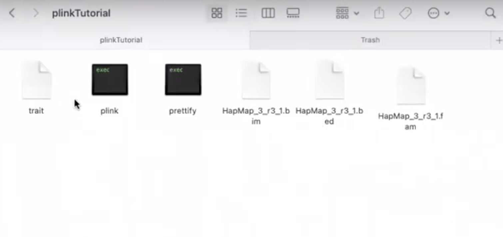
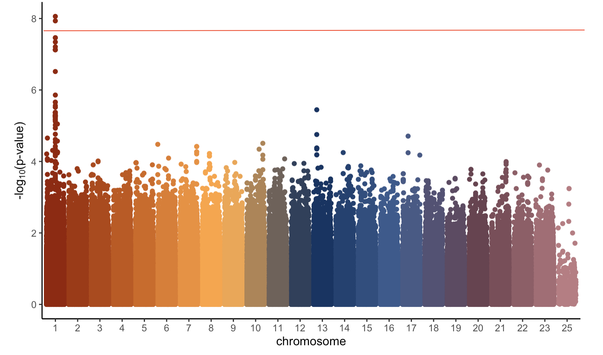

```{r setup, include=FALSE}
knitr::opts_chunk$set(echo = TRUE)

# Learn more about creating websites with Distill at:
# https://rstudio.github.io/distill/website.html
```

```{r, echo=FALSE}
library(snpStats)
library(tidyverse)
library(broom)
library(NatParksPalettes)
library(parallel)
library(GGally)   

fam <- 'hapmapData/HapMap_3_r3_1.fam'
bim <- 'hapmapData/HapMap_3_r3_1.bim'
bed <- 'hapmapData/HapMap_3_r3_1.bed'

hapmap <- read.plink(bed, bim, fam)

X <- as(hapmap$genotypes, "numeric")
```

Now that we have shown that RStudio is not a computationally efficient software for multiple hypothesis testing, we will show how to do it in PLINK. PLINK is a free, open-source whole genome association analysis toolset, designed to perform a range of basic, large-scale analyses in a computationally efficient manner. To learn more about PLINK and how to download and use it, check out [this site](https://zzz.bwh.harvard.edu/plink/) [@plink], which we relied heavily on. There are several different versions of PLINK online - once you download it, you should have a folder containing two black boxes: one called "plink" and one called "prettify". Once downloaded onto your computer, PLINK runs from the terminal. We can run a GWAS in PLINK in a matter of a couple seconds instead of 30-60 minutes. 

The first step of this is to shown how to run a GWAS in PLINK. Unlike in the example shown using RStudio, we will actually generate a trait of interest based off a randomly selected causal SNP (*rs2476601*) for this example GWAS.

# Run a GWAS 

## Step 1

Select `pedigree` and `member` columns from the data and bind them to the trait of interest. These are just columns PLINK requires to run a GWAS.

```{r}
set.seed(494)
y = cbind(hapmap$fam %>% select(1:2), trait = X[,'rs2476601'] + rnorm(165, 0, 1))
head(y)
```

## Step 2 

Write the file to the folder with your data and the plink application. After writing the file, the folder should look something like the image below.

```{r, eval=FALSE}
write_delim(y, "plinkTutorial/trait")
```



## Step 3: 

Next, open the folder where your data and the PLINK application are located in terminal. Run the command `./plink --bfile HapMap_3_r3_1 --assoc --adjust --pheno trait --out gwas1`. What this is saying is using the `HapMap_3_r3_1` files, run an association test with our phenotype of interest `trait` and send the results to a file called `gwas1.qassoc.adjusted`. The `--adjust` means to run one GWAS not accounting for any population structure in the data and one GWAS that does account for population structure (meaning it will make the p-values from the marginal regression models be less inflated, or small). There is not much population structure in this dataset so this is not something we need to worry about/focus on for this analysis.

## Step 4

Finally, we read the results back into RStudio and look at most significant SNPs. In a genetic study with a real disease for a trait of interest, these are the SNPs that we would spend time and money studying further and learning more about.

```{r, e}
gwas1 <- read_table("plinkTutorial/gwas1.qassoc.adjusted") %>%
  arrange(UNADJ)
head(gwas1)
```

## Step 5

If we want, we can create a Manhattan plot, which plots the $-\text{log}_{10}(\text{p-value})$ of each of SNPs with the trait of interest. The visually helps us see where exactly some of the more significant SNPs are located. The question to ask now is how many SNPs do we look at? Which SNPs might actually be associated with our trait of interest? This is where determining a threshold with multiple hypothesis testing becomes especially useful.

```{r, eval = FALSE}
gwas1 <- gwas1 %>%
  mutate(CHR = as.integer(CHR)) %>%
  left_join(hapmap$map %>%
              dplyr::select(snp.name, position, chromosome), by = c("SNP" = "snp.name", "CHR" = "chromosome"))

gwas1 %>%
  mutate(minuslogp = -log10(GC),
         CHR = as.factor(CHR)) %>%
  ggplot(aes(x = CHR, y = minuslogp, group = interaction(CHR, position), color = CHR)) + 
  geom_point(position = position_dodge(0.8)) + 
  labs(x = 'chromosome', y = expression(paste('-log'[10],'(p-value)')))+
  theme_classic()+
  scale_color_manual(values=natparks.pals("DeathValley",24))+
  theme(legend.position = "none")
```


# Run Multiple Hypothesis Testing in PLINK

## Step 1

The first step of multiple hypothesis testing in PLINK is to generate a null trait. This example will do 1,000 replications in PLINK, so we will generate 1,000 null traits of normally distributed random noise.

```{r, eval=FALSE}
create_quantitative_trait <- function(i){
  y <- rnorm(n = 165, mean = 0, sd = 1)
}

traits <- as.data.frame(replicate(1000, create_quantitative_trait()))
```

## Step 2

Next, we select the `member` and `pedigree` information on each individual and column bind on the 1,000 null traits. This creates a table with one row for each person (165 rows) and 1,0002 columns (`member`, `pedigree`, plus the 1000 traits).

```{r, eval=FALSE}
traitReps <- cbind(hapmap$fam %>%
        dplyr::select(1:2), traits)
```

## Step 3

Write the `traitReps` table to the same folder where the data and the PLINK application is stored.

```{r, eval=FALSE}
write_delim(traitReps, "plinkTutorial/traitReps")
```

## Step 4 

Open the folder where the data and the PLINK application are located in terminal. Run the command `./plink --bfile HapMap_3_r3_1 --assoc --pheno traitReps --all-pheno --pfilter 1e-3`. What this is saying is using the `HapMap_3_r3_1` files, run one association test with each of our 1000 null traits in the `traitReps` file. Only keep p-values that are smaller than $1 \times 10^{-3}$ to limit the size of the files created. This will create 1000 files titled `plink.P*.qassoc` in the `plinkTutorial` folder, where the * is the number of the file.

## Step 5

Then read the 1,000 file into RStudio. It depends on the size of the files how long this takes, but for this dataset it takes about 3 minutes.

```{r, eval=FALSE}
dataFiles <- lapply(Sys.glob("plinkTutorial/plink.P*.qassoc"), read_table)
```

## Step 6

Finally, take the smallest p-value from each of the 1,000 genetic-wide association studies, and then take the 5% quantile (desired FWER) of those 1000 smallest p-values. This gives us our threshold. We got $3.39 \times 10^{-8}$.

```{r, eval=FALSE}
pvalues <- sapply(dataFiles, function(x) min(x$P, na.rm=TRUE))
quantile(pvalues, 0.05)
```

We can then go back to our original GWAS and see which SNPs have p-values below this threshold of $3.39 \times 10^{-8}$. As shown in the manhattan plot below, there are two SNPs with p-values smaller than our threshold. One of these is our causal SNP *rs2476601*, and the other is a neighboring SNP that likely contains very similar information to our causal SNP. In a true genetic study, we would not know if either of these is truly associated with our trait of interest until we devote further time and resources into studying them. 



# Conclusion and future steps

PLINK has allowed us to efficiently (a) run a GWAS to find important relationships between genetic data and a trait of interest and (b) determine which SNPs from that GWAS to devote further time and resources to. In the future, we would like to do this process with a more diverse set of data, which would require us to learn the additional steps necessary for accounting for the confounding effects of family and population structure in genetic data.


