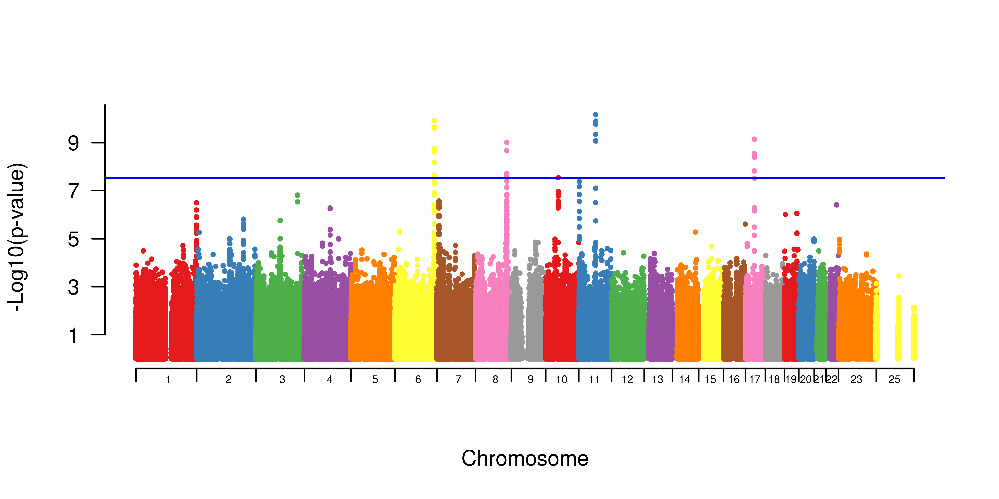
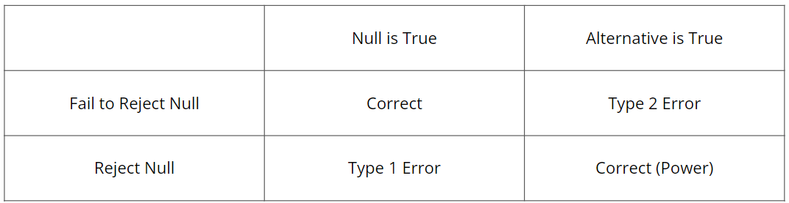
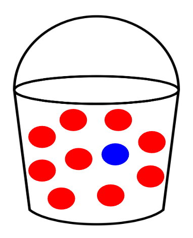

```{r setup, include=FALSE}
knitr::opts_chunk$set(echo = FALSE)

# Learn more about creating websites with Distill at:
# https://rstudio.github.io/distill/website.html
```

## Genome Wide Association Studies

To understand the need for multiple hypothesis testing, we need to be familiar with Genome Wide Association Studies(GWAS) and the complexities to working with genetic data.

### Explanation of GWAS

If we compare any two human genomes, they are nearly identical. However, places where DNA sequences differ are known as genetic variants. Once there is a collection of variants to be studied, GWAS attempts to determine which genetic variants are associated with an illness (Type One Diabetes, Crohn's Disease) or trait of interest (height, blood pressure).

There are multiple types of genetic variants, but GWAS is focused on variants that are exchanges of one nucleotide base pair for another, otherwise known as single nucleotide polymorphisms(SNPs). Figure 1 is a visual example of a SNP.

<strong>SNPs</strong> : DNA variations that occur when a single nucleotide base pair in the genome sequence is altered (AT vs GC at a single position).

<center>
{width=40%}
</center>

### Working with Genetic Data

When working with genetic data and running GWAS, the number of SNPs to be studied is commonly greater than 1,000,000. Because of this, we cannot simply fit a multiple linear regression model to predict the existence of an illness or the value of a trait of interest. As an equation, this would be equivalent to <strong>E[y | x] = ꞵ + ꞵ1x + ... + ꞵnx</strong>, where y is the trait and x is the number of minor alleles.

In this situation, our goal would be to find a line of best fit where “best” is described as the minimized sum of squared residuals, which requires complicated derivations. This would be quite time consuming and difficult to find the optimal ꞵ0 and ꞵ1...ꞵn considering how large the number of predictors is. Even if we used a different technique such as matrix derivation, because there are more SNPs(columns) than individuals we are studying(rows), our matrix is not invertible and thus our least squares estimator is not defined. This conclusion is proven through linear algebra.

Instead, we utilize <strong>Marginal Regression</strong>, where instead of one multiple linear model, we make "n" linear models one by one equal to the number of SNPs we are studying. As an equation, this would be equivalent to <strong>E[y | xj] = ꞵ + ꞵ1xj + ... + ꞵnxj</strong>, where y is the trait and x is the number of minor alleles at that SNP. From these marginal regressions, we receive test statistics and p-values for each SNP. Once we have a p-value for each SNP, we can begin to visualize these values and make decisions of whether or not a SNP is associated with our trait of interest. Figure 2 is an example of how we can visualize p-values, known as a Manhattan Plot. The y-axis is -log10 transformed so that smaller p-values appear as higher on the plot. For now, ignore the horizontal blue line.

<center>
{width=90%}
</center>

## Hypothesis Testing in GWAS

In order to make these decisions of whether or not an association exists, we utilize hypothesis testing. As you read this section, note that the null hypothesis in GWAS is that there is no relationship between a SNP and the trait of interest. 

### Hypothesis Testing Review

To review, hypothesis testing is predicated on the comparison of a p-value and a predetermined significance threshold, commonly represented as 𝛼 and equal to 0.05. There are two hypotheses, the null hypothesis and the alternative hypothesis. If a p-value is less than the significance threshold, we reject the null hypothesis and therefore conclude the alternative hypothesis to be true. In context, we would conclude that there is a relationship between that SNP and the trait of interest. On the other hand, if a p-value is greater than the significance threshold, we cannot reject the null hypothesis and therefore conclude the null hypothesis to be true. In context, we would conclude that there is not a relationship between that SNP and the trait of interest. Figure 3 is a table that summarizes the decisions we can make and the consequences of those decisions. We desire to correctly reject the null as much as possible(power) while avoiding both falsely rejecting the null(Type 1 Error) and failing to reject the null when we should (Type 2 Error).

<center>
{width=90%}
</center>

### The Multiple Testing Problem

Aside from the added GWAS context, our explanation should be identical to what you would encounter in an introductory statistics course. However, there is additional complexity in GWAS because of the aforementioned need for marginal regression. Recall, we are not running one hypothesis test, but millions, and this drastically effects our ability to conclude that a SNP is significantly associated. 

To illustrate, imagine there is a bucket with ten balls inside, nine are red and one is blue, as seen in Figure 4. If you reach in the bucket once, your chance of grabbing a red ball is 90% (9/10). If you reach in the bucket five times, independently, your chance of grabbing a red ball all five times is 59% (.9^5). In this five-ball scenario, your chance of grabbing the blue ball <strong>at least once</strong> increases from 10%(one-ball scenario) to 41%. As expected, if you reach in the bucket ten times, independently, your chance of grabbing a red ball all ten times is even smaller, 35% (.9^10), and your chance of grabbing the blue ball <strong>at least once</strong> increases to 65%. Overall, the more times you reach in the bucket, the higher the chance of grabbing at least one blue ball.

<center>
{width=50%}
</center>

With this in mind, consider every time you reach into the bucket as a hypothesis test and the event of grabbing the blue ball as Type 1 Error. As the number of hypothesis tests increases, the chance of at least one Type 1 Error increases. In words, if we reject the null hypothesis when we witness a "rare" event, it will be easier to find rare events and furthermore easier to mistakenly think that an event is truly rare as the number of tests get increasingly larger. Clearly, this is a major problem with the multiple hypothesis testing procedure that is needed to make decisions in GWAS.

This concept is further supported by this equation, <strong>P(at least 1 Type 1 Error) = 1 - (1 - 𝛼)^n</strong>, which holds due to a number of proofs that we will point out but won't fully explain at this time. First, according to mathematical statistics proofs, 𝛼 is equal to the chance of Type 1 Error for a singular hypothesis test. Second, according to probability proofs, P(A >= 1) = 1 - P(complement of A) where A = Type 1 Error. Lastly, we can raise our equation to the power of n, with n being the number of hypothesis tests we are running, because we assume each test to be independent. 

### Determining a Threshold

we want fwer to be 0.05 not alpha, so we control with bonferroni 

imagine if .05 on manhattan plot, show image

## False Discovery Rate