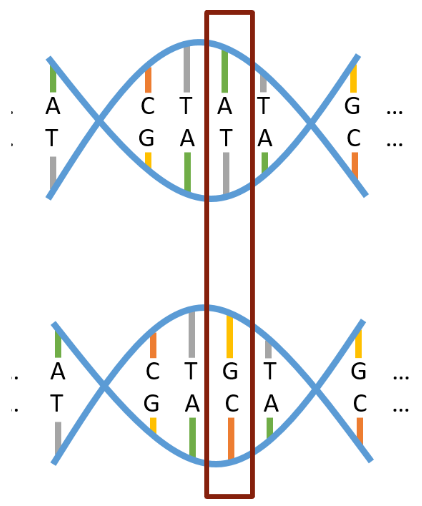

```{r setup, include=FALSE}
knitr::opts_chunk$set(echo = FALSE)

# Learn more about creating websites with Distill at:
# https://rstudio.github.io/distill/website.html
```

## Genome Wide Association Studies

To understand the need for multiple hypothesis testing, we need to be familiar with Genome Wide Association Studies(GWAS) and the complexities to working with genetic data.

### Explanation of GWAS 
If we compare any two human genomes, they are nearly identical. However, places where DNA sequences differ are known as genetic variants. Once there is a collection of variants to be studied, GWAS attempts to determine which genetic variants are associated with an illness (Type One Diabetes) or trait of interest (height).

There are multiple types of genetic variants, but GWAS is focused on variants that are exchanges of one nucleotide base pair for another, otherwise known as single nucleotide polymorphisms(SNPs). Figure 1 is a visual example of what a SNP is.

<u>SNPs</u> : DNA variation that occurs when a single nucleotide base pair in the genome sequence is altered (AT vs GC at a single position).

<center>
{width=40%}
</center>


In order to make statements on whether or not a genetic variant is associated with the trait of interest, we utilize hypothesis testing.


## Hypothesis Testing Review


